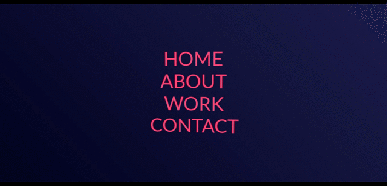

# Perspective-Split-onHover-Text-Menu

Updated: February 2, 2021  
Using SCSS and JavaScript to manipulate 2 layers of  masks.  
When the user hovers around the body, the text menu tracks the mouse movement.  
When the user hovers over menu-items, they split.
